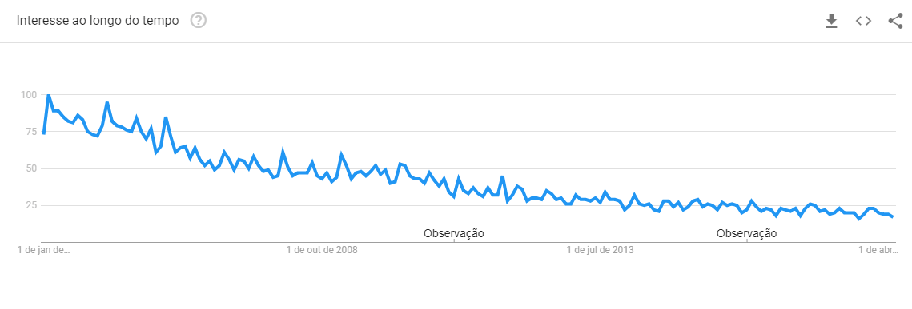
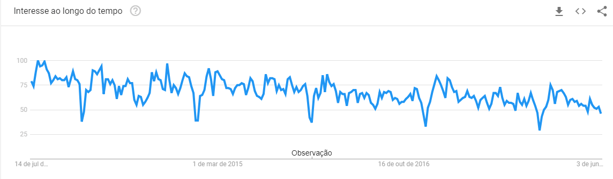
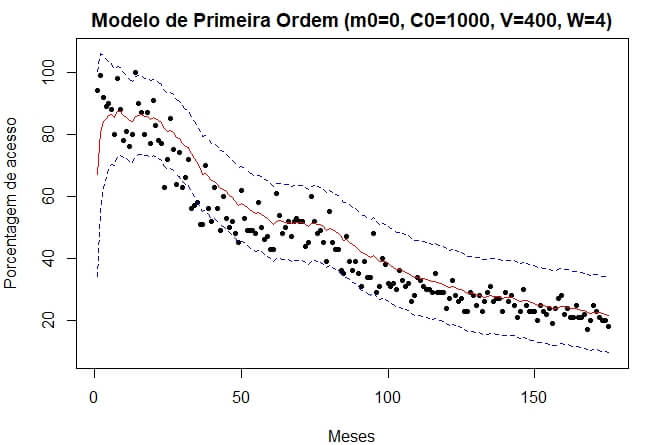
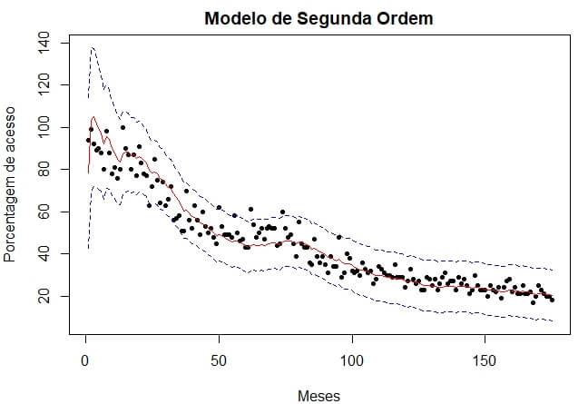
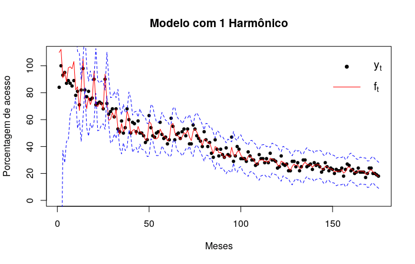
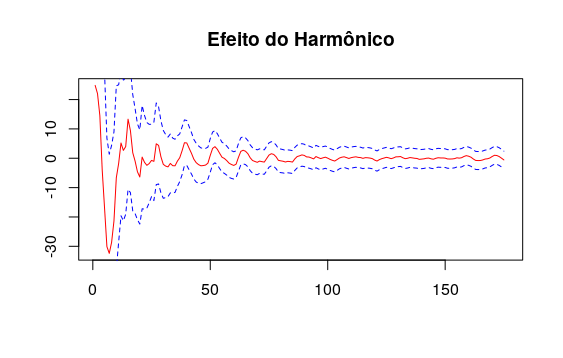

# III Escola de Matemática Aplicada
# MODELOS DINÂMICOS BAYESIANOS

Projeto desenvolvido na [III Escola de Matemática Aplicada](http://www.cemeai.icmc.usp.br/component/jem/event/65-3-escola-de-matematica-aplicada) do curso [Modelos Dinâmicos e Aplicaçes](http://www.cemeai.icmc.usp.br/component/k2/item/681-modelos-dinamicos-e-aplicacoes) ministrado pelo professor [Helio S. Migon](http://www.dme.ufrj.br/migon/) (UFRJ).  
__Resumo:__ A Modelagem dinâmica e previsão  Bayesiana  de séries temporais é uma das mais importantes áreas surgidas no final do século passado.
Tem como ponto de partida os modelos de regressão. A inclusão de uma evolução temporal dos parâmetros da regressão dão origem a uma ampla classe de modelos incluindo vários temas da estatística moderna. (ver Migon, H.S et al,Handbook ofStatistics Vol 25, Cap. 19, 553-588, 2006. e também Pole West e Harrison, 1994).

__Ementa:__
1. Introdução aos modelos dinâmicos. 
2. Modelos dinâmicos lineares. 
3. Aspectos teóricos de modelos dinâmicos de séries temporais. 
4. Modelos polinomiais, sazonais e  de regressão. 
5. Monitoramento e intervenção. 
6. Tópicos especiais: MLG dinâmicos,  Modelos Hierárquicos dinâmicos. 
7. Exemplos: Chuva-vazão, propaganda em TV, tábuas de mortalidade, modelos de credibilidade dinâmico etc.

-----------------------------
# Projeto 
&emsp;O objetivo do projeto consiste em consolidar os conhecimentos do curso em uma aplicação. 
  Cada grupo de alunos escolhia uma base dados para aplicar os modelos.

__Grupo:__
Emanuelle A. Paixão (UFLA) - 
Gustavo C. Libel (UTFPR) - 
Junior R. Ribeiro (ICMC)

__Descrição dos dados utilizados:__
Os dados utilizados para análise correspondem a uma série mensal de
Janeiro/2004 a Julho/2018, descrevendo a porcentagem de pesquisa do termo
“USP” no Google Web acessados no Brasil (Figura 1 - (a)). Tais dados estão
normalizados pelo maior valor (frequência relativa). Ressalta-se que em todas as
análises, foi considerado que os dados apresentam uma distribuição normal.

&emsp; De uma forma geral, pode-se perceber, uma tendência de decaimento
acentuado no número de pesquisas do termo “USP” ao longo dos anos, com alguns
picos e vales, o que pode caracterizar a existência de uma possível sazonalidade
(Figura 1 - (a)). Esse decaimento talvez sugira que, quando a internet começou a se
popularizar, as pessoas tinham grande curiosidade em conhecer a universidade,
curiosidade essa que foi diminuindo devido à ampliação da divulgação e difusão de
oportunidades pelo meio eletrônico, por ser uma realidade mais rotineira.

&emsp; Na Figura 1 (b), pode-se observar de forma mais detalhada o comportamento
da série em um intervalo mais reduzido, de Julho/2013 a Julho/2018. Percebe-se
que os maiores valores de pico ocorrem geralmente nos meses de Janeiro,
Fevereiro e Agosto. Tal fato pode ser explicado pela publicação dos resultados dos
processos seletivos e vestibulares e posterior, período de matrícula da universidade,
que é semestral. Note que nos meses de Julho e Dezembro, há uma baixa
frequência de pesquisas do termo (vales acentuados), possivelmente causada pelo
período de recesso escolar.

||
|:--:| 
|*(a) Percentual de acesso do termo “USP” de janeiro de 2004 a julho de 2018.*|
||
|*(b) Percentual de acesso do termo “USP” de julho de 2013 a julho de 2018.*
|*__Figura 1:__ Percentual de pesquisas do termo “USP” no Google acessados no Brasil durante o período de Janeiro/2004 a Julho/2018 (a). Em (b), destaca-se o comportamento da série em um período mais reduzido, de Julho/2013 a Julho/2018. Fonte: Google Trends.*|

&emsp; Na Figura 2, apresenta-se o ajuste do Modelo Linear de Primeira Ordem e na
Figura 3, o Modelo Linear de Segunda Ordem; em vermelho consta a previsão em 1
passo, em azul as faixas de confiança e os pontos correspondem aos dados
observados. Pode-se perceber a existência de diversas observações fora do
intervalo de confiança e também que a curva de predição não descreve totalmente a
variação dos dados.

||
|:--:| 
|*__Figura 2:__ Ajuste do Modelo Dinâmico de Primeira Ordem aos dados analisados, considerando m0 = 0, C0 = 1000, V = 400 e W = 4.*|

||
|:--:| 
|*__Figura 3:__ Ajuste do Modelo Dinâmico de Segunda Ordem aos dados analisados,
considerando m0 = c(0,0), C0 = diag(1000,n,n) e W = diag(c(0.02, 0.01)).*|

&emsp; Como pode-se perceber ao comparar as Figuras 2 e 3, o ajuste de um Modelo
Linear de Segunda Ordem foi capaz de descrever melhor as variações dos dados, pois
menos pontos ficaram fora da faixa de confiança. Porém, o modelo ainda não consegue
descrever com eficácia o comportamento dos dados observados.

&emsp; Dessa forma, optou-se pelo ajuste de um modelo que considerasse a existência da
sazonalidade, ou seja, utilizar séries harmônicas truncadas. Na Figura 4 - (a), é apresentada
uma modelagem, considerando uma série harmônica truncada em apenas 1 harmônico e
variância desconhecida. É perceptível que o modelo descreve melhor as variações
presentes nos dados observados. O efeito do harmônico sobre os dados é mostrado na
Figura 4 - (b). Nota-se uma suavização ao longo do tempo devido a diminuição da variância
dos dados.

||
|:--:|
|(a)| 
||
|:--:|
|(b)| 
|*__Figura 4:__ Ajuste do Modelo Dinâmico com 1 Harmônico, considerando variância desconhecida e W=2π/12 (a) e respectivo efeito do harmônico (b).*|

__REFERÊNCIAS:__

____ Plataforma Google Trends. https://trends.google.com.br/trends. Acesso em 14 de julho de 2018.  
[MAROTTA, Raíra.](https://github.com/rairamarotta) Algoritmo usado durante o curso.
